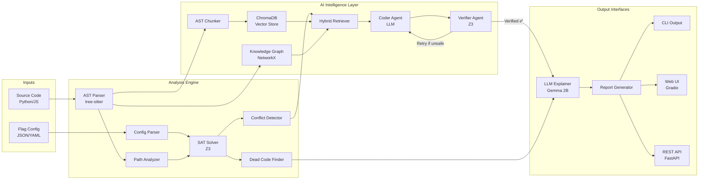
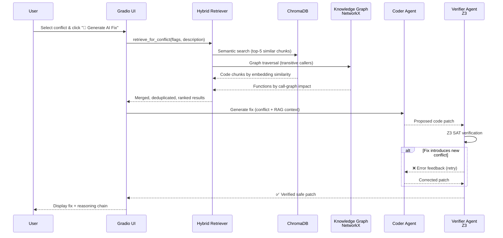
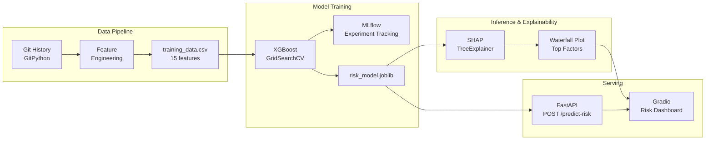

<div align="center">

# 🛡️ FlagGuard
**Enterprise-Grade AI Feature Flag Intelligence Platform**

<p align="center">
  <a href="#-ai-native-intelligence-layer-graphrag"></a>
  <a href="#-system-design--architecture"></a>
  <a href="#-the-challenge-technical-debt-at-scale"></a>
</p>

<p align="center">
  <em>Mathematically proving feature flag safety before you deploy. Used to detect conflicts, dead code, and impossible states.</em>
</p>

[](https://pypi.org/project/flagguard/)
[](LICENSE)
[](https://www.python.org/downloads/)
[](https://github.com/laxmi2577/flagguard/actions)
[](https://fastapi.tiangolo.com/)

---


</div>

---

## 🚨 The Challenge: Technical Debt at Scale

In modern CI/CD pipelines, feature flags are essential. However, as organizations scale to **100+ active feature flags**, they introduce a dangerous new vector of technical debt:

*   **Silent Failures:** Enabling *Flag A* while *Flag B* is turned off can create unanticipated, untested execution paths that crash production. (The infamous 2012 Knight Capital $440M loss was fundamentally a feature flag collision).
*   **The "Dead Code" Swamp:** Engineering teams frequently leave code blocks protected by permanently disabled flags in the codebase for years, confusing new developers and bloating bundles.
*   **Undocumented Dependencies:** "Tribal knowledge" dictates that *Feature X* only works if *Service Y* is enabled, but this is never enforced in the code itself.

**FlagGuard** solves this by shifting feature flag analysis entirely to the **left**. Instead of waiting for runtime metrics to show failure, FlagGuard mathematically proves impossible states during the PR process.

---

## ⚡ Why Top Engineering Teams Need FlagGuard

Unlike standard linters, FlagGuard operates at the intersection of **Abstract Syntax Trees (AST)** and **Formal Verification**.

### 1. 🧠 SAT-Based Conflict Detection (Zero False Positives)
FlagGuard parses your codebase, translates your feature flag rules into Boolean logic equations, and feeds them into Mircosoft's **Z3 SMT Solver**. It mathematically calculates if two nested flag conditions represent an impossible state, guaranteeing zero false positives.

### 2. 🗑️ Automated Dead Code Elimination
By applying constraint solving against your codebase AST (via `tree-sitter`), FlagGuard flags code blocks that are mathematically unreachable based on your current LaunchDarkly, Unleash, or custom JSON/YAML flag configurations.

### 3. 🤖 Agentic AI Remediation (GraphRAG)
FlagGuard doesn't just *explain* conflicts — it **fixes them**. A multi-agent system retrieves relevant source code via a **Hybrid Retriever** (ChromaDB semantic search + NetworkX call graph), generates a code patch via a **Coder Agent**, and mathematically verifies it through a **Z3 Verifier Agent** — all in an autonomous retry loop. See the [AI Intelligence Layer](#-ai-native-intelligence-layer-graphrag) below for the full architecture.

### 4. 📊 Enterprise Dashboard & RBAC REST API
FlagGuard isn't just a CLI. It includes a beautiful, interactive "Liquid Glass" web UI built on Gradio, backed by a production-ready **FastAPI** backend featuring JWT Authentication, Role-Based Access Control, and SQLite/PostgreSQL persistence.

---

## 🏗️ System Design & Architecture

FlagGuard is a modular, offline-first analysis engine with an **AI-native intelligence layer**. The architecture combines formal verification (Z3), knowledge graphs (NetworkX), vector databases (ChromaDB), and multi-agent LLM orchestration into a single pipeline.



### Core Architecture Components
1. **Multi-Language AST Scanner:** Uses `tree-sitter` to scan Python and JavaScript/TypeScript source code to detect complex branching patterns like `if is_enabled("flag_name"):`.
2. **Boolean Satisfiability (SAT) Solver:** Encodes codebase execution paths and feature flag dependencies as pure boolean logic constraints using Microsoft's **Z3 SMT solver**.
3. **Persisted State & RBAC:** Stores analytical results, RBAC user permissions (`admin`, `analyst`, `viewer`), and multi-environment drifts (dev/staging/prod) in an isolated SQLAlchemy database.

---

## 🤖 AI-Native Intelligence Layer (GraphRAG)

> **The core differentiator.** FlagGuard's AI layer goes far beyond simple LLM prompting — it is a full **GraphRAG + Agentic Remediation** system that retrieves, reasons, and self-corrects.



### Architecture Components

| Component | Technology | File | Purpose |
|-----------|-----------|------|---------|
| **AST Chunker** | tree-sitter | `rag/ingester.py` | Extracts function-level semantic chunks (not naive line splits) with metadata: `function_name`, `class_name`, `flags_referenced` |
| **Vector Store** | ChromaDB + SentenceTransformers | `rag/store.py` | Persists embeddings for semantic similarity search |
| **Knowledge Graph** | NetworkX DiGraph | `ai/graph.py` | Directed call graph with transitive impact analysis via reverse BFS |
| **Hybrid Retriever** | ChromaDB + NetworkX | `rag/retriever.py` | Fuses semantic search with graph traversal; items found by both get a relevance boost |
| **Coder Agent** | Ollama / Gemma 2B | `ai/agent.py` | Generates `git diff` patches grounded in retrieved source code |
| **Verifier Agent** | Z3 SMT Solver | `ai/agent.py` | Mathematically proves patches don't introduce new conflicts |
| **Agentic Loop** | Max 3 retries | `ai/agent.py` | Coder → Verifier → Retry cycle; only verified patches reach the user |

### Key Design Decisions

1.  **AST-Aware Chunking > Line Splitting:** Traditional RAG systems chunk code by fixed line counts (50-100 lines), splitting functions mid-body and mixing unrelated logic. FlagGuard uses tree-sitter to extract *complete* functions as atomic chunks, dramatically improving retrieval precision.

2.  **Graph + Vector = Hybrid Retrieval:** Semantic search alone misses transitive dependencies (e.g., `checkout()` → `auth_check()` → `is_enabled("premium")`). The Knowledge Graph catches these via reverse BFS traversal, while ChromaDB catches conceptually similar code. Items found by *both* strategies are ranked highest.

3.  **Formal Verification in the Loop:** Unlike standard AI coding assistants that suggest unverified patches, FlagGuard's Verifier Agent feeds every proposed fix back through the Z3 SAT solver. Only mathematically proven-safe patches are presented to the user — **zero hallucinated fixes**.

---

## 📈 Predictive Risk ML Pipeline (XGBoost + SHAP)

> **Predict conflicts before they happen.** A classical ML pipeline that learns from your git history to predict whether a commit is likely to introduce feature flag conflicts — and explains *why* using SHAP.



### ML Architecture Components

| Component | Technology | File | Purpose |
|-----------|-----------|------|---------
| **Feature Extractor** | GitPython | `scripts/generate_training_data.py` | Mines 15 per-commit features from `.git` history (flag mentions, file types, commit hour, author experience) |
| **Data Augmentation** | NumPy | `scripts/generate_training_data.py` | Synthetic sample generation for class-balanced training (30% conflict rate) |
| **Model Training** | XGBoost + scikit-learn | `notebooks/train_risk_model.py` | GridSearchCV (5-fold CV) over depth/LR/estimators; logs to MLflow |
| **Experiment Tracking** | MLflow | `mlruns/` | Tracks params, metrics (AUC, F1, Precision, Recall), and model artifacts |
| **SHAP Explainer** | SHAP TreeExplainer | `ai/risk_explainer.py` | Per-prediction feature attributions with waterfall plot generation |
| **REST API** | FastAPI + Pydantic | `api/risk.py` | `POST /predict-risk` returns score + SHAP factors; `GET /risk-model-info` |
| **Dashboard** | Gradio | `ui/tabs/risk_dashboard.py` | SVG risk gauge (0-100%), SHAP factor table, feature impact chart |

### Engineered Features (14 dimensions)

```text
┌─── Diff Metrics ──────────────┐  ┌─── Code Metrics ─────────────┐
│  files_modified               │  │  py_files_modified            │
│  lines_added / lines_deleted  │  │  js_files_modified            │
│  diff_size_ratio (del/add)    │  │  config_files_modified        │
│  flag_mentions_count          │  │  has_test_changes             │
└───────────────────────────────┘  └───────────────────────────────┘

┌─── Temporal Metrics ──────────┐  ┌─── Author Metrics ────────────┐
│  commit_hour (0-23)           │  │  author_commit_count          │
│  is_merge_commit              │  │  message_length               │
│  days_since_last_commit       │  │                               │
└───────────────────────────────┘  └───────────────────────────────┘
```

---

## 📚 Comprehensive Documentation Directory

We maintain rigorous documentation standards. Explore the architecture and usage guides below:

*   🚀 **[Installation & Quick Start Guide](docs/INSTALLATION.md)** — CLI installation, CI/CD pipeline integration, and Web UI setup.
*   🏗️ **[Architecture & System Design](docs/ARCHITECTURE.md)** — Deep dive into the Z3 SAT solver implementation, AST parsing, and relational database schema.
*   🔌 **[API Reference & SDK Docs](docs/API_DOCUMENTATION.md)** — Documentation for the Python SDK, 31 FastAPI REST endpoints, and CLI commands.
*   🤝 **[Contributing Guidelines](docs/CONTRIBUTING.md)** — How to submit PRs, run local tests, and add support for new parsers like Split.io.

---

## 🛠️ Quick Start Implementation

Install FlagGuard using [`uv`](https://github.com/astral-sh/uv) (recommended) or `pip`:

```bash
uv tool install flagguard
```

### 1. Perform a Static Codebase Audit
Execute a local mathematical proof of your feature flags against your source code:

```bash
flagguard analyze --config config/prod_flags.json --source ./src/backend --fail-on-critical
```

### 2. Launch the Enterprise Dashboard
Spin up the interactive Web UI and FastAPI backend to manage environments and view interactive dependency graphs:

```bash
# Start the web interface
uv run python src/flagguard/ui/app.py
```
*Login with `admin@example.com` / `Admin@123` at http://localhost:7860.*

---

## 🗺️ Engineering Roadmap (v0.2.0 - v1.0.0)

FlagGuard is actively developed with a focus on enterprise scalability:

- **[In Progress] Global Language Expansion:** High-performance AST parsing for Go, Java, and Ruby codebases.
- **[Planned] Enterprise Identiy:** SAML SSO integration and advanced Audit Logging retention.
- **[Planned] Developer Experience:** Official VS Code Extension for real-time mathematical conflict highlighting in IDE.
- **[Planned] Security Integrations:** SARIF output formats for direct ingestion into GitHub Advanced Security.

If you are a platform engineer with a feature request, please open a [GitHub Issue](https://github.com/laxmi2577/flagguard/issues/new).

---

## 👨‍💻 About the Author

**Laxmiranjan Sahu**  
*AI\ML Engineer*

FlagGuard was architected and developed from the ground up to address critical gaps in continuous delivery safety. I specialize in building highly resilient automation architectures, distributed systems, and QA infrastructure for enterprise applications.

Let's connect:
- 📧 **Email:** [laxmiranjan444@gmail.com](mailto:laxmiranjan444@gmail.com)
- 💼 **LinkedIn:** [linkedin.com/in/laxmiranjan](https://www.linkedin.com/in/laxmiranjan)
- 🌐 **Portfolio:** [laxmiranjansahu.vercel.app](https://laxmiranjansahu.vercel.app)
- 🐙 **GitHub:** [github.com/laxmi2577](https://github.com/laxmi2577)

---

## 🛡️ License & Project Governance

FlagGuard is Open Source and released under the **MIT License** — see the [LICENSE](LICENSE) file for details.

*   Need architectural support? Read our [Support Guidelines](SUPPORT.md).
*   Have a zero-day vulnerability to report? Read our secure [Security Policy](SECURITY.md).

<div align="center">
  <i>Architected with precision for the feature flag engineering community.</i>
</div>
