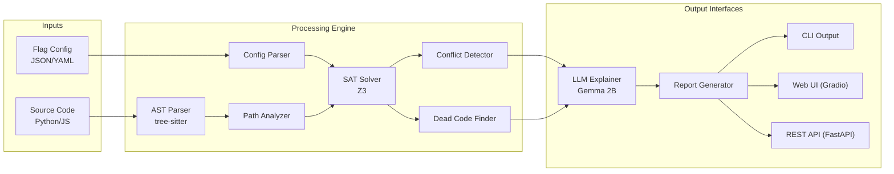

# FlagGuard Architecture

FlagGuard is designed as a modular, offline-first static analysis tool combining Abstract Syntax Trees (ASTs), SAT Solving (Z3), and Local LLMs (Ollama).

---

## 🏗️ High-Level System Architecture



---

## 🧩 Core Components

### 1. Parsers
- **Config Parser**: Reads feature flag definitions (LaunchDarkly, Unleash, Generic) and extracts flag states, dependencies, and variations.
- **AST Scanner**: Uses `tree-sitter` to scan Python and JavaScript/TypeScript source code to detect patterns like `is_enabled("flag_name")`.

### 2. Analysis Engine
- **FlagSATSolver**: Encodes feature flag dependencies and codebase usage as boolean logic constraints using Microsoft's Z3 SMT solver.
- **Conflict Detector**: Proposes mathematical states to the SAT solver to find impossible conditions (e.g., Flag A depends on Flag B, but Flag B is hardcoded to `false`).
- **Dead Code Finder**: Identifies code paths that require an impossible combination of flags to execute.

### 3. Interfaces
- **Web UI**: A complete Gradio-based dashboard featuring Role-Based Access Control, interactive Plotly charts, dependency graphs, and multi-environment management.
- **REST API**: A robust FastAPI backend with 31 endpoints, JWT auth, SQLite/PostgreSQL support, and webhook dispatching.
- **CLI**: A Click-based terminal tool for seamless CI/CD integration.

---

## 🗄️ Database Schema Mapping

FlagGuard persists projects, environments, and scans to a relational database using SQLAlchemy.

| Model | Description |
|-------|-------------|
| `User` | Authentication state with RBAC (`admin`, `analyst`, `viewer`). |
| `Project` | Represents an application or repository being analyzed. |
| `Environment` | Development, Staging, or Production configs with specific `flag_overrides`. |
| `Scan` | Represents a single analysis run, tied to a Project and Environment. |
| `ScanResult` | The large JSON blob containing the conflict report and LLM explanations. |
| `WebhookConfig` | Project-level webhooks triggered asynchronously on scan completion. |
| `AuditLog` | Immutable record of user actions and security events. |
| `Schedule` | Persistent cron jobs for automated background scanning. |
| `PluginConfig` | User-defined custom parsers injected at runtime dynamically. |

---

## 📂 Directory Structure

```text
flagguard/
|-- api/                  # REST API (FastAPI routes)
|   |-- auth.py           # JWT auth + RBAC
|   |-- server.py         # Main Uvicorn app
|
|-- analysis/             # Engine
|   |-- sat_solver.py     # Z3 constraint encoding
|   |-- conflict_detector.py
|   |-- dead_code.py
|
|-- cli/                  # Command-line interface
|   |-- main.py           # Click commands
|
|-- core/                 # Shared infrastructure
|   |-- db.py             # SQLAlchemy session management
|   |-- models/tables.py  # Database ORM classes
|   |-- roles.py          # RBAC enum system
|
|-- parsers/              # Input ingestion
|   |-- launchdarkly.py   # Config parsers
|   |-- ast/              # Tree-sitter code extractors
|
|-- llm/                  # AI Integration
|   |-- ollama_client.py  
|   |-- explainer.py      # Prompt templates
|
|-- ui/                   # Web Interface
    |-- app.py            # Gradio Web UI entry point
    |-- tabs/             # Dashboard modules
    |-- handlers.py       # Shared business logic
```
