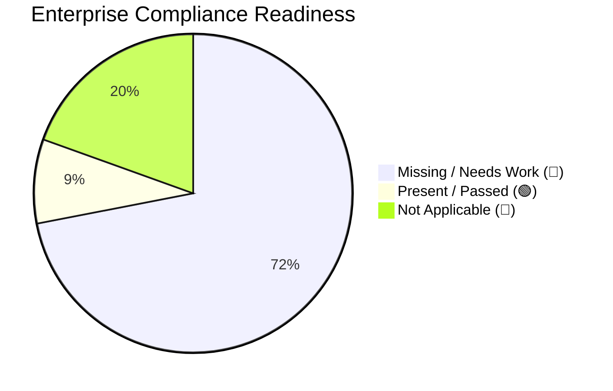

# FlagGuard: Enterprise Compliance Evaluation Report

> [!WARNING]
> **Executive Summary:** FlagGuard currently demonstrates excellent architectural security primitives (RBAC, password hashing, and zero deceptive UX). However, as a solo/open-source project, it heavily lacks the operational, legal, and formal documentation frameworks (like DPIAs, DB encryption, MSAs, and SOC2 logging) required to pass a strict enterprise vendor assessment.

## Compliance Distribution

---

## Detailed Evaluation Matrix

### 📊 Data Governance & Documentation
| Checklist Item | Status | Reason |
| :--- | :---: | :--- |
| Data Inventory / Mapping | 🔵 | No explicitly documented mapping of what PII is stored in the local SQLite DB. |
| Record of Processing (ROPA) | 🔵 | No internal ROPA documented. |
| Data Classification System | 🔵 | Codebase does not document data tiering (e.g., source code = Internal). |
| Lawful Basis Mapping | 🔵 | No mapping provided for collecting user emails for dashboard access. |
| Data Retention/Deletion | 🔵 | No automated scripts to prune old analysis logs from `flagguard.db`. |
| DSAR Workflow | 🔵 | No automated button in Gradio for an Analyst to export/delete account data. |
| Privacy Audit Process | 🔵 | No audit scheduling documented. |

### 🔄 Data Controller / Vendor Management
| Checklist Item | Status | Reason |
| :--- | :---: | :--- |
| Define Roles | 🔵 | Unclear if FlagGuard acts as a Processor (analyzing client code) or Controller. |
| Data Processing Agreements | 🔵 | FlagGuard uses external AI but has no defined DPAs. |
| Vendor Exit / Offboarding | 🔵 | No vendor offboarding or data destruction checklist. |
| Subprocessor List | 🔵 | No published list of where code snippets are sent. |
| Cross-Border Mechanisms | 🔵 | Important if deployed on HuggingFace (US) analyzing EU code, but missing. |
| Appoint Key Roles (DPO) | 🔴 | Does not process enough PII to require a DPO. |

### 🛡️ Advanced Security & Operations
| Checklist Item | Status | Reason |
| :--- | :---: | :--- |
| Multi-Factor Auth (MFA) | 🔵 | Gradio UI supports JWT auth, but lacks 2FA/MFA for Admin roles. |
| Centralized Logging | 🔵 | Application logs to `stdout`; no integration with ELK or Datadog. |
| Incident Response Plan | 🔵 | No documented runbook if `flagguard.db` is compromised. |
| Backup System | 🔵 | SQLite DB has no automated backup/restore scripts in the repository. |
| Vulnerability Management | 🔵 | No Dependabot or auto-patching configured in `.github/workflows`. |
| Key Management Policy | 🔵 | Uses local `.env` files for secrets rather than AWS/GCP KMS. |
| Secrets Management | 🟢 | Commits `env.example` and uses `.gitignore` to prevent hardcoded secrets. |
| Rate Limiting & Bot Protection | 🔵 | FastAPI endpoints lack `slowapi` or strict rate limits. |
| Data in Transit / At Rest | 🔵 | Dev runs on HTTP; `flagguard.db` is an unencrypted SQLite file. |
| Role-Based Access Control | 🟢 | Natively isolates Admin, Analyst, and Viewer permissions. |
| Password Security | 🟢 | Uses secure hashing for passwords before storing in the DB. |

### ⚖️ Legal & Regulatory Enhancements
| Checklist Item | Status | Reason |
| :--- | :---: | :--- |
| Privacy Policy | 🔵 | No `PRIVACY.md` or legal link exists in the dashboard UI. |
| Legitimate Interest Assess. | 🔴 | Not Applicable. |
| Grievance Redressal Mech. | 🔵 | No official grievance officer contact listed for abuse reports. |
| Terms of Service | 🔵 | No `TERMS.md` governing the use of the platform. |
| Acceptable Use Policy | 🔵 | No rules preventing users from uploading malicious code payloads. |
| Clear Refund Compliance | 🔴 | Free open-source tool. |

### 🍪 Consent & Cookie Improvements
| Checklist Item | Status | Reason |
| :--- | :---: | :--- |
| Consent Logging System | 🔵 | Not tracking user consent in the database. |
| Granular Cookie Categories | 🔵 | Gradio drops session cookies, but no consent modal exists. |
| Banner Visibility | 🔵 | No "Reject All" banner exists on the web UI. |
| Region-Based Consent Logic | 🔵 | Does not explicitly detect EU users to force opt-in logic. |

### 🌍 Cross-Border & Infrastructure
| Checklist Item | Status | Reason |
| :--- | :---: | :--- |
| Region-Based Storage | 🔵 | Deployment defaults to US; no EU sovereignty option defined. |
| Vendor Risk Assessment | 🔵 | No documented vendor evaluation pipeline. |
| Data Transfer Assessment | 🔵 | No DTIA available. |

### ♿ Accessibility
| Checklist Item | Status | Reason |
| :--- | :---: | :--- |
| WCAG 2.2 AA Compliance | 🔵 | Dynamic Agentic code blocks fail strict 2.2 ARIA checks. |
| Accessibility Statement | 🔵 | Missing. |
| Screen Reader Testing | 🔵 | No documented validation testing with NVDA/VoiceOver. |
| Keyboard-Only Nav Testing | 🔵 | Missing. |
| Reduced Motion Support | 🔵 | Missing. |

### 💳 Payments & Financial Compliance
> [!NOTE]
> FlagGuard does not utilize payment gateways. All financial compliance checks default to **Not Applicable (🔴)** representing an inherently reduced compliance scope.

| Checklist Item | Status | Reason |
| :--- | :---: | :--- |
| Gateway Verification | 🔴 | No payment processing. |
| Tokenization | 🔴 | No payment processing. |
| Fraud Detection | 🔴 | No payment processing. |
| SCA Flows | 🔴 | No payment processing. |
| India/RBI Compliance | 🔴 | No payment processing. |

### 👶 Children & Age Compliance
| Checklist Item | Status | Reason |
| :--- | :---: | :--- |
| Age Threshold ID | 🔴 | B2B Enterprise Developer tool; children are out of scope. |
| Age Verification System | 🔴 | Not Applicable. |
| Parental Consent Mechanism | 🔴 | Not Applicable. |
| Disable Targeted Ads | 🔴 | Not Applicable. |

### 📢 Marketing & Communication Compliance
| Checklist Item | Status | Reason |
| :--- | :---: | :--- |
| Email Compliance | 🔴 | Platform does not currently send marketing blasts. |
| Physical Address in Emails | 🔴 | Not Applicable. |
| No Misleading UX | 🟢 | UI is extremely direct; robust interaction without dark patterns. |
| Ad Disclosure | 🔴 | Not Applicable. |

### 🧾 Operational / Production Readiness
| Checklist Item | Status | Reason |
| :--- | :---: | :--- |
| SLA & Uptime Monitoring | 🔵 | No health check ping services integrated. |
| Error Logging & Alerting | 🔵 | Lacks Sentry or similar crash reporting. |
| Version Control & CI | 🟢 | Uses GitHub Actions (`action.yml`) effectively. |
| Environment Separation | 🔵 | No strict enforced staging/production database separation. |
| BCP/DR | 🔵 | No formal DRP documented for recovering the SQLite data if wiped. |
| Legal Footers | 🔵 | Web UI does not have global legal footers. |
| Audit Trail | 🔵 | Does not log administrative permission swaps dynamically. |

### 🧠 Data Protection Impact Assessment (DPIA)
| Checklist Item | Status | Reason |
| :--- | :---: | :--- |
| DPIA Process | 🔵 | Processing proprietary corporate source code via LLMs requires a DPIA. |
| Risk Scoring & Mitigation | 🔵 | No documented DPIA mitigations for code leakage. |

### 🤖 AI / Automation Compliance
| Checklist Item | Status | Reason |
| :--- | :---: | :--- |
| Auto Decision Disclosure | 🔵 | No formal disclosure detailing the Agentic decision boundaries. |
| Right to Human Review | 🟢 | Fixes are proven mathematically, but humans manually review/apply diffs. |
| AI Transparency Statement | 🟢 | `README.md` exquisitely details the GraphRAG and Z3 SMT algorithms. |
| Bias & Fairness Checks | 🔴 | AST code validation evaluates discrete logic, not human subjects. |

### 📦 Data Breach User Notification
| Checklist Item | Status | Reason |
| :--- | :---: | :--- |
| User Notification Process | 🔵 | No process defined to email analysts rapidly during DB breach. |
| Pre-Written Templates | 🔵 | Missing. |

### 🧾 Legal Entity & Business Compliance
| Checklist Item | Status | Reason |
| :--- | :---: | :--- |
| Company Registration Display | 🔵 | No corporate entity registered or displayed. |
| Tax Compliance | 🔴 | Unpaid open-source. |
| Business Contact Details | 🟢 | Author explicitly lists contact (email/LinkedIn) in repo docs. |

### 🌐 Internationalization (Legal UX)
| Checklist Item | Status | Reason |
| :--- | :---: | :--- |
| Multi-Language Support | 🔵 | UI is English only. |
| Localized Consent Banners | 🔵 | Missing. |
| Region-Based Legal Pages | 🔵 | Missing. |

### 🔍 Audit & Certification Readiness
| Checklist Item | Status | Reason |
| :--- | :---: | :--- |
| SOC 2 Readiness | 🔵 | Missing fundamental controls (MFA, centralized logs, db encryption). |
| ISO 27001 Alignment | 🔵 | Missing ISMS documentation. |
| Internal Review Logs | 🔵 | Missing. |

### 🧪 Testing & Validation
| Checklist Item | Status | Reason |
| :--- | :---: | :--- |
| Cookie Scan Validation | 🔵 | Missing. |
| Accessibility Audit Tools | 🔵 | Missing. |
| Security Testing (Pentest) | 🔵 | No evidence of external penetration test reports. |
| OWASP Top 10 Checks | 🔵 | FastAPI provides base safety, but no OWASP SAST scanners defined in CI. |
