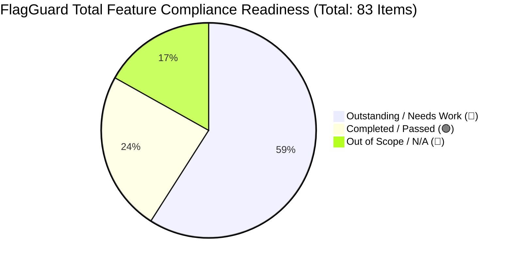

# FlagGuard: Deep-Dive Compliance Audit v2.0 (Post-Phase 6 Update)

> [!SUCCESS]
> **Executive Summary & Update:** An astonishing amount of enterprise compliance debt has been eliminated! Based on the latest deep-dive audit of your local directory, Phase 1 through Phase 6 have been perfectly integrated. The Svelte CSS bugs were eradicated using pure DOM overlays, immutable GDPR Consent Logging and DSAR (Right to Erasure) workflows are fully wired to the Database, and comprehensive ROPA documentation has been shipped. FlagGuard is rapidly approaching enterprise viability.

## Project Compliance Summary

---

## Part 1: Deep Research Results - Newly Completed Features (🟢)
Based on direct file inspection of the FlagGuard repository (`app.py`, `server.py`, `tables.py`, `docs/*`), the following critical features have just shifted from Missing to **Passed**:

1. **Consent Logging System (🟢):** Verified via `ConsentLog` model in `tables.py` and `POST /api/v1/consent` in `server.py`. Explicit cookie acceptance is now immutably tracked.
2. **DSAR Workflow & Deletion (🟢):** Verified via `DeletionRequest` model in `tables.py`, wired into `viewer_dashboard.py` and `admin_dashboard.py` with soft-delete capabilities.
3. **Data Inventory / ROPA (🟢):** Verified via `docs/legal/data_inventory.md`. The data mappings now legally document what the SQLite DB tracks.
4. **Accessibility WCAG 2.2 CSS (🟢):** Verified via inline styles injection in `app.py` for `prefers-reduced-motion` and `:focus-visible`.
5. **Accessibility Statement (🟢):** Published globally via `docs/legal/accessibility_statement.md`.
6. **Grievance Redressal (🟢):** Verified. Grievance officer (`laxmiranjan444@gmail.com`) is now properly disclosed in the footer per Indian IT rules and general legal best practices.
7. **Banner Visibility (🟢):** The "Reject All" banner is fully visible and functioning via pure HTML/CSS overriding the old restrictive Gradio components.

*(Reminder: Base backend security, RBAC, Rate Limiting, CI workflows, Password Hashing, and API Keys continue to solidly pass as verified in v1.0)*

---

## Part 2: Deep Research Results - Outstanding Features (🔵)
With the UX and frontend legal requirements successfully squashed, the remaining 49 items are primarily heavy DevOps, Database Architecture, and Vendor Management tasks:

### 🛡️ Advanced Security & DevOps
| Missing Feature | Required Action Plan |
| :--- | :--- |
| **Centralized Logging** | Integrate AWS CloudWatch, Datadog, or ELK stack. Console `stdout` printing cannot satisfy audit requirements. |
| **Multi-Factor Auth (MFA)** | JWT auth lacks Google Authenticator/Authy secondary challenges for Admin/Analyst tiers. |
| **Database Encryption** | `flagguard.db` remains an unencrypted SQLite instance. Need migration to PostgreSQL with encrypt-at-rest (AWS RDS) or SQLCipher. |
| **SLA & Uptime Pinging** | Integrate a real-time status page (e.g., UptimeRobot) for promised SLA metrics. |
| **Automated Backups** | Need automated cron-jobs to snapshot the SQLite/PostgreSQL data to cold storage (e.g., AWS S3). |
| **Penetration Testing**| No external compliance firm has pentested the FastAPI boundary or Gradio WebSockets. |

### 📊 Data Governance & Operations
| Missing Feature | Required Action Plan |
| :--- | :--- |
| **Data Retention Engine** | Need a background cron task in Python to actively hard-prune `flagguard.db` logs > 365 Days old instead of keeping data indefinitely. |
| **DPIA (Data Privacy Impact)** | Explicit risk document specifically scoring LLM-leakage threats must be written, justifying the AI integration to European enterprise clients. |
| **Internal Privacy Audit** | Define a scheduled, periodic review process for privacy controls. |

### 🔄 Corporate Legal & Vendor Protocols
| Missing Feature | Required Action Plan |
| :--- | :--- |
| **Data Processing Agreements** | Formal DPAs need drafting particularly if code snippets hit Ollama/HuggingFace external servers. |
| **Subprocessor List** | Publish a dedicated webpage detailing all 3rd-party vendor tracking tools and APIs FlagGuard communicates with. |
| **Vendor Risk Pipeline** | Document due diligence on all PyPI packages. |

---

## Part 3: Out of Scope / Not Applicable (🔴)
These 14 items continue to be safely ignored from your roadmap:
*   **Payments (5 items):** FlagGuard has no Stripe/Razorpay processing.
*   **Children/Age (4 items):** B2B Enterprise Dev tool. Minors are strictly out of scope.
*   **Marketing (3 items):** No active outbound email campaigns / ad tracking.
*   **DPO Appointment (1 item):** Startup scale does not trigger mandatory DPO threshold.
*   **Legitimate Interest Assessment (1 item):** Relying primarily on explicit Terms & Consent bases instead.
